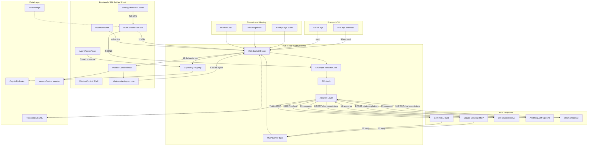
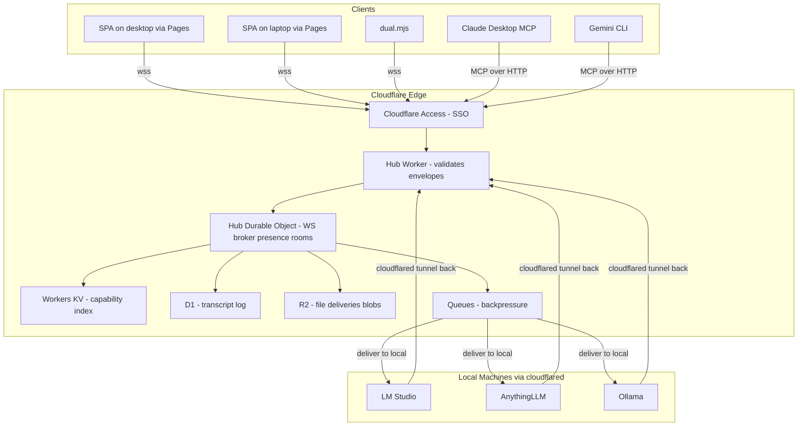

# Aether Shunt — LLM Coordination Hub Blueprint

> **Status:** Architectural blueprint. No implementation code in this document.
> **Persona:** Master Systems Architect.
> **Date authored:** 2026-05-08.
> **Scope:** Steers Aether Shunt from a single-user text-transformation SPA into a multi-LLM Coordination Hub where local LLMs (LM Studio, AnythingLLM, Ollama) and frontier agents (Claude Desktop, Gemini CLI) message each other bidirectionally.

---

## 0. Premise & Constraints

**Goal:** Both of zack's computers, plus Claude and Gemini (CLI or web), participate as peers on a single addressable message bus. Local LLMs hand off tasks to large LLMs; large LLMs request aid from each other and from local helpers. The Aether Shunt project is the hub.

**Hard constraints inherited from `CLAUDE.md`:**
- Vite + React 18 + TypeScript SPA
- Single OpenAI-compatible HTTP egress in `styles/services/aiService.ts`
- No vendor SDKs (no `@google/genai`, no Anthropic SDK in browser)
- No `.env` — runtime config in `localStorage` under `ai-shunt-settings`
- `@/*` path alias is mandatory
- Provider order in `App.tsx` is load-bearing
- Lazy-loaded MissionControl tabs

**Reusable primitives already in the codebase:**
- `dual.mjs` — Claude↔Gemini stdio relay with `/relay c->g` and `/relay g->c`
- `MCPContext.tsx` — `window.mcpExtension` boundary with mock fallback
- `MailboxContext.tsx` — versioned inbox with unread tracking
- `lib/eventBus.ts` — typed singleton pub/sub
- `aiService.ts` — single OpenAI-compatible chokepoint

---

## 1. Inverse Analysis — Failure Conditions

A blueprint that does not neutralize all seven of these is guaranteed to fail.

1. Browser SPAs cannot accept inbound connections — no listening socket, CORS-restricted.
2. No persistent identity/registry of which LLMs are reachable from where.
3. No common message envelope across MCP tool-calls, OpenAI chat-completions, and Gemini function-calls.
4. No transport that simultaneously survives Tailscale (private mesh), Netlify (public CDN), and localhost.
5. Conversation state loss on relay — context window drift.
6. No flow control — fast Gemini floods slow LM Studio.
7. No auth — anyone on the LAN injects messages.

---

## 2. Cross-Domain Leap — Selected Metaphor

**IRC/XMPP federation.** Selected over postal-sorting (Mailbox already serves that) and service-mesh (folds in as capability registry sub-pattern) because it is the only domain that natively supports asynchronous bidirectional messaging across federated nodes with addressable participants and rooms.

| Hub concept | IRC/XMPP analog |
|---|---|
| Connected LLM | User |
| `#main`, `#code`, `#research` | Channel |
| `@claude`, `@gemini`, `@lmstudio-home` | JID |
| Capability advertisement | RFC 6121 entity caps |
| Mailbox | Offline message delivery |
| Bus Transcript Log | MUC history |

---

## 3. Architecture Decision — Hybrid B+C

Rejected: WebRTC mesh (CLI agents can't join). Rejected: pure WebSocket relay (loses MCP alignment).

**Selected: a single tiny Node relay process that exposes two faces:**
1. **WebSocket** for the SPA and `dual.mjs`
2. **MCP server (stdio + HTTP)** for Claude Desktop, Gemini, and any MCP-speaking client

One process, one transcript log, one capability registry — two protocols.

---

## 4. Phase 1 — Core Architecture Breakdown

### Frontend (UI/UX)

| Module | Function | New / Existing | Dependencies |
|---|---|---|---|
| `MissionControl` shell | Tabbed shell; adds **Hub** tab | extend | `App.tsx` providers |
| `HubConsole` | Roster, room picker, composer, transcript | new | `useHubBus`, `MailboxContext` |
| `AgentRosterPanel` | Presence + capability badges | new | `useHubBus` |
| `RoomSwitcher` | `#main`, `#code`, `#research`, custom | new | `useHubBus` |
| `MailboxContext` | Inbox for messages addressed to this tab | extend | `versionControlService` |
| `MiaAssistant` | Local agent face; speaks on bus as `@mia` | extend | `useHubBus`, `aiService` |
| `useHubBus` | React hook over WS connection + envelope helpers | new | hub relay URL from settings |

### CLI Surface

| Module | Function | New / Existing |
|---|---|---|
| `dual.mjs` | Add `/hub <addr> <msg>` and `/join <room>` slash commands; speak WS | extend |
| `hub-cli.mjs` | Standalone CLI participant: `node hub-cli send @claude "hello"` | new |

### Backend (Logic/Processing)

| Module | Function | New / Existing |
|---|---|---|
| `hub/server.mjs` | WS broker + MCP server, ~300 LOC, Node stdlib + `ws` + `@modelcontextprotocol/sdk` | new |
| `hub/capability-registry.mjs` | In-memory map of agent JIDs → capabilities, rebuilt from JOIN envelopes | new |
| `hub/envelope.ts` | Zod schema: `{ id, from, to, room, kind, body, replyTo, ttl, capabilities? }` | new (lives in `types/schemas.ts`) |
| `hub/acl.mjs` | Per-room owner list, deny-by-default for unknown JIDs | new |
| `hub/adapter/openai.mjs` | Envelope ↔ `/v1/chat/completions` for LM Studio, AnythingLLM, Ollama | new |
| `hub/adapter/mcp.mjs` | Envelope ↔ MCP tool calls for Claude/Gemini | new |
| `aiService.ts` | Add `sendToAgent`, `subscribeToRoom`; becomes a hub client | extend |

### Data (Storage/State)

| Store | Purpose | New / Existing |
|---|---|---|
| `hub/transcripts/<room>.jsonl` | Append-only log per room; supports replay | new |
| `localStorage:ai-shunt-hub` | Per-SPA: hub URL, token, identity, room prefs | new |
| `MailboxContext` storage | Existing inbox repurposed for inbound `kind: "deliver"` envelopes | extend |
| `versionControl.service.ts` | Snapshot file deliveries from bus | existing |

---

## 5. Phase 2 — User Journey & Data Flow

**Scenario:** zack asks Claude to consult Gemini and have local LM Studio summarize for AnythingLLM on his laptop.

1. SPA opens **Hub** tab. `useHubBus` connects WS to `ws://hub.tail.ts:7777` (Tailscale) or `wss://aether-shunt.netlify.app/hub` (public).
2. SPA sends JOIN: `{ from: "@desktop-spa", caps: ["chat","mcp:fs","ui"], rooms: ["#main"] }`. Registry indexes; relay broadcasts PRESENCE.
3. Claude Desktop connects via MCP-stdio as `@claude` with caps `["reason","code","tools:mcp"]`. Gemini joins via extended `dual.mjs` as `@gemini`.
4. Adapter polls LM Studio `/v1/models` and AnythingLLM `/v1/models`; registers `@lmstudio-home`, `@anythingllm-laptop` automatically.
5. zack types: `@claude please ask @gemini how to debounce ResizeObserver, then have @lmstudio-home summarize for @anythingllm-laptop`.
6. SPA wraps in envelope `{ kind: "task", from: "@zack", to: "@claude" }`. Relay validates, ACL-checks, forwards to Claude.
7. Claude emits `{ kind: "request_aid", from: "@claude", to: "@gemini" }`. Relay routes.
8. Gemini replies `{ kind: "response", from: "@gemini", to: "@claude", replyTo: <id> }`. Relay routes back.
9. Claude sends `{ kind: "task", to: "@lmstudio-home", body: "summarize: ..." }`. Adapter translates to OpenAI HTTP POST.
10. LM Studio responds; adapter wraps as `{ kind: "deliver", to: "@anythingllm-laptop" }` and forwards.
11. SPA, subscribed to `#main`, renders every hop live. Log appends to `transcripts/#main.jsonl`.
12. Final summary lands in `MailboxContext` with kind `"summary"`. Unread badge ticks; `MiaAssistant` surfaces it.
13. If laptop SPA was offline, relay holds the envelope (TTL ≤ 24h); on reconnect, replays from JOIN offset.

---

## 6. Phase 3 — Visual System Blueprint



---

## 7. Envelope Schema (canonical)

```text
Envelope {
  id            : uuid
  from          : "@<jid>"
  to            : "@<jid>" | "#room" | "*"   // * = broadcast within room
  room          : "#main" | string
  kind          : "join" | "leave" | "presence"
              | "task" | "request_aid" | "response"
              | "deliver" | "summary" | "stream_chunk" | "error"
  body          : string | object            // content; renderer decides
  replyTo       : uuid | null
  ttl           : seconds (default 86400)
  capabilities  : string[]                   // only on join/presence
  ts            : ISO-8601
  trace         : uuid                       // groups related hops
}
```

Validated by Zod at the relay edge. Any envelope failing validation is rejected with `kind: "error"` to the sender.

---

## 8. Provider Order Update for `App.tsx`

The provider stack must change to:

```
SettingsProvider
└─ TelemetryProvider
   └─ MCPProvider
      └─ HubProvider                ← new: WS connection, presence, send/subscribe
         └─ MailboxProvider         ← now consumes Hub deliveries
            └─ MiaProvider
               └─ SubscriptionProvider
                  └─ UndoRedoProvider
                     └─ AppContent
```

Rationale: `HubProvider` depends on Settings (for hub URL/token) and MCP (for the extension's tunneling capability). Mailbox depends on Hub (deliveries arrive there). Mia depends on both.

---

## 9. Tunnel Strategy

| Path | Use | Listener | URL pattern |
|---|---|---|---|
| Tailscale | Cross-machine private | Relay binds Tailscale IP | `ws://hub.tail-scale.ts.net:7777` |
| Netlify Edge | Public access from anywhere | Relay hosted on Fly.io / user's VPS; Netlify proxies | `wss://aether-shunt.netlify.app/hub` |
| localhost | Dev | Relay binds 127.0.0.1 | `ws://localhost:7777` |

Netlify hosts the **SPA only**. The relay must run as a real process — Netlify Edge Functions are not appropriate for long-lived WebSockets at the free tier (verify against current Netlify capability tier before deployment).

---

## 10. Identified Gaps Requiring Search

I cannot confirm these without web search; they affect adapter implementation only:

1. `"Gemini CLI MCP support 2026"` — current MCP transport status
2. `"AnythingLLM agent skill webhook API"` — inbound endpoint distinct from `/v1/chat/completions`
3. `"Netlify Edge Functions WebSocket support"` — current capability tier

The adapter layer is the only surface that depends on these answers. Keep the bus vendor-neutral so a wrong assumption costs one adapter only.

---

## 11. Flaw Watch (per Proactive Analysis directive)

| # | Flaw | Probability of impact | Mitigation |
|---|---|---|---|
| 1 | **Adapter sprawl** — bespoke adapter per LLM | High | Enforce 4-method interface: `send`, `receive`, `advertise_capabilities`, `health`. Reject anything that bypasses it. |
| 2 | **No streaming in `aiService.ts`** | High | Add SSE to adapter contract from day one, even if v1 is non-streaming. |
| 3 | **Per-tab identity collision** | Medium | Mint JID from `userId + tabId`, not `userId`. |
| 4 | **No backpressure** | Medium | Per-agent send queue with bounded depth at the relay. |
| 5 | **Envelope schema drift between SPA and relay** | High | Single source of truth in `types/schemas.ts`; relay imports the same Zod schema. |
| 6 | **Mailbox grows unbounded** | Low | Enforce TTL eviction in `MailboxContext`. |

---

## 12. Implementation Constraint Layer

User declined to declare budget/time/skill constraints during blueprint authoring. Per protocol: only the **pure theoretical model** is presented above. The "constrained" model (e.g., "what if I have 4 hours and zero backend skill?") is omitted due to lack of constraint data. Re-engage if constraints become known.

---

## 13. Cloudflare-Native Variant (RECOMMENDED — supersedes Section 9)

User has Cloudflare. This collapses six pieces of infra into one platform and removes the "must run a Node process somewhere" constraint entirely. **Adopt this variant unless a hard reason to self-host emerges.**

### Component Mapping: Cloudflare → Hub

| Hub piece | Cloudflare primitive | Why it fits |
|---|---|---|
| Hub Relay (WS broker) | **Durable Object** | Stateful single-instance object; native WebSocket hibernation; designed for chat/coordination |
| Capability Registry | **Workers KV** | Low-latency reads, eventual consistency is fine for presence |
| Envelope Validator | **Worker** (edge function) | Zod runs at the edge; rejects malformed envelopes before they hit the DO |
| Bus Transcript Log | **D1** (SQLite) or **R2** (JSONL blobs) | D1 for queryable history; R2 for cheap append-only |
| ACL/Auth | **Worker + Cloudflare Access** | Zero Trust SSO in front of WS upgrade; per-JID tokens issued via Worker |
| Cross-machine reach | **Cloudflare Tunnel (cloudflared)** | Each computer's local LM Studio / AnythingLLM exposed as `https://lmstudio-home.<your>.cf` without port forwarding |
| Public SPA hosting | **Cloudflare Pages** | Replaces Netlify; same DX, integrated with Workers |
| Backpressure / fan-out | **Cloudflare Queues** | Buffers fast-producer / slow-consumer pairs |
| Per-machine private DNS | **Cloudflare Zero Trust** | `claude-desktop.<your>.cf`, `gemini-laptop.<your>.cf` |

### Updated Architecture (replaces Section 6 mermaid for the Cloudflare path)



### Why this is strictly better than the Node relay

1. **No "always-on machine" requirement.** The DO runs at the edge globally; your laptop can sleep and the hub stays up.
2. **WebSocket hibernation** is built in — DOs can hold thousands of idle WS connections cheaply.
3. **Cloudflare Tunnel** removes port-forwarding work *and* gives you DNS names for local LLMs without exposing them publicly.
4. **Zero Trust Access** gives you the auth/ACL layer for free (Section 1, failure #7) — solved.
5. **Single deployment surface.** Pages (SPA) + Worker (relay) + DO (state) + KV/D1/R2 (storage) all `wrangler deploy`'d together.
6. **You already have Cloudflare MCP connected in this session** — the relay can be created, deployed, and inspected from this conversation if you authorize it.

### Concrete component plan (Cloudflare-native)

| Resource | Name | Purpose |
|---|---|---|
| Pages project | `aether-shunt` | Static SPA |
| Worker | `hub-relay` | WS upgrade handler, envelope validator, MCP HTTP endpoint |
| Durable Object class | `HubRoom` | One DO instance per `#room`, holds connected JIDs |
| KV namespace | `HUB_CAPABILITIES` | JID → capability list |
| D1 database | `hub_transcripts` | Append-only message log per room |
| R2 bucket | `hub-deliveries` | File payloads from `kind: "deliver"` envelopes |
| Queue | `hub-backpressure` | Buffer for slow local LLM consumers |
| Tunnels | one per local machine | `lmstudio-home`, `anythingllm-laptop`, `ollama-home` |
| Access policy | `hub.<your>.cf` | Zero Trust SSO gate for the WS endpoint |

### What changes in the SPA code

- `useHubBus` connects to `wss://hub.<your>.cf/ws` instead of `ws://hub.tail-scale.ts.net:7777`
- Identity bootstrap: SPA calls `https://hub.<your>.cf/auth/issue-jid` (Worker route) which returns a signed JID + token after Access SSO
- `MCPContext.tsx` — the `window.mcpExtension` slot can wrap the cloudflared tunnel detector so MCP file ops route through CF

### Migration sequence (no constraint data → presented as theoretical model only)

1. Create CF account resources (Worker, DO, KV, D1, R2) — can be done from this chat using the Cloudflare MCP
2. Author `hub-relay` Worker with envelope schema imported from `types/schemas.ts`
3. Install `cloudflared` on both your machines; expose LM Studio + AnythingLLM with named tunnels
4. Build `useHubBus` and `HubConsole` in the SPA
5. Extend `dual.mjs` with `/hub` slash-command speaking the same Worker WS
6. Register Claude Desktop and Gemini as MCP clients pointing at `https://hub.<your>.cf/mcp`

---

## 14. Locked-In Decisions from Three-Way AI Consensus

**Date validated:** 2026-05-08 via the live file-bus. Peers: `@claude`, `@claude-code`, `@gemini`, `@lmstudio`. Trace: envelopes `01000000-…000001` and `01000000-…000007` plus `@claude-code` ping `76bb2c80-…`. Full transcript in `hub-bus/transcript.jsonl`.

### Locked decisions

| Decision | Source | Rationale |
|---|---|---|
| **Durable Object per room** as central routing boundary; `idFromName(roomName)` for sharding | `@gemini` (primary), corroborated by `@lmstudio` "central router only" | Two model families, independent reasoning, same conclusion. Guarantees ordering + presence in one place per room. Scales horizontally to millions of rooms. |
| **Hybrid bridges + central validator** | `@gemini` direct, `@claude` synthesis, `@lmstudio` reluctantly accepts | Per-agent bridges remain (only way to reach local LM Studio / CLI subprocesses). DO is the centralized validator/router/loop-detector. Bridges are dumb adapters. |
| **Coarse `kind` + separate `intent` field** | `@gemini` | `kind` ∈ `{request, reply, event, broadcast, system}` describes routing pattern. `intent` (e.g. `tool-call`, `summarize`, `file-write`) describes application semantics. DO routes on `kind` alone; agents read `intent`. New capabilities never touch DO code. |
| **Per-room hop ceiling on `trace`** with global hard cap | `@lmstudio` + `@gemini` | Default 8 hops per trace; per-agent overrides must stay within room ceiling, never exceed global floor/ceiling. Enforced at DO ingress. |
| **Passive Auditor** in DO, NOT active critic-injection (in v0.2) | `@gemini` (middle path), aligned with `@lmstudio` | DO-level hook logs divergence/loop anomalies without blocking. Trains future active rejection. No latency cost, no adversarial-feedback risk. |
| **Machine-as-node tunneling** | `@gemini` | One `cloudflared` per machine, not per LLM. Local gateway fans out by header/path. Simpler DNS, easier SSL, intuitive offline semantics. |
| **DO Hibernation** for idle WS connections | `@gemini` (bonus) | Keeps cost near zero with dozens of agents idle in rooms. |

### Schema fields that MUST survive promotion to KV/DO

Union of all three peer answers + my additions:

`id`, `from`, `to`, `room`, `kind`, `intent`, `body`, `replyTo`, `trace`, `seq` (per-sender monotonic), `ts` (causal timestamp), `expiresAt` (absolute, replaces relative `ttl`), `capabilities` (on `join`/`presence` only), `sig` (issuer signature), `issuer` (JID that signed).

### New finding from the debate (deferred to v0.3)

**Type-Safe Rooms.** `@gemini` flagged that the opaque `body` field is the project's biggest unflagged risk: when `@claude` emits structured JSON and `@lmstudio` replies prose, the next agent's parsing fails. Each room must declare a Zod schema; the DO rejects envelopes whose body doesn't match. Tracked as Task #11.

### Cosmetic note for the Gemini bridge

Gemini-CLI scans bodies for file-path-like tokens (e.g. `CLAUDE.md`, `gemini-bridge.mjs`) and uses them as pseudo-addressees in its salutations. Routing is unaffected; the bridge could optionally prefix the body with a sanitized header to suppress this artifact.

---

## 15. Non-Obvious Tips (per non-coder enthusiast directive)

1. The Mailbox is already a working inbox primitive — reusing it is cheaper than building a second one.
2. `dual.mjs` already proves the relay pattern works in stdio. Extending it to also speak WebSocket is one `import { WebSocket } from 'ws'` and one event handler away.
3. Tailscale gives cross-machine reach without port-forwarding work. Bind the relay to the Tailscale interface; both machines see it as `hub.<your-tailnet>.ts.net`.
4. Netlify hosts the **SPA**, not the hub. Run the relay where it's most often online (one of your machines) and let the Netlify-served SPA connect outbound.
5. Identity must be stable per-tab, not per-user — `userId + tabId`.
6. The single biggest wedge against vendor lock-in is the Envelope schema. Defend it.
